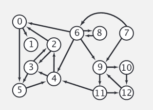

# Unweighted graphs and digraphs with modern C++

## General
- Code for unweighted graph and digraph problems
- no usage of owning raw pointers, `new`, or similarly dated patterns
- unit tests under `test/`
- this is a sample project and not a huge library
- for weighted graphs and digraphs see [this repository](https://github.com/nspo/weighted-graphs-cpp)

## Unweighted graphs

### `include/Graph.h`
- Simple (undirected) `Graph` interface
- `AdjacencyListGraph` (https://en.wikipedia.org/wiki/Adjacency_list)
- Basic utility functions (a few)
- Find paths starting at a vortex to all connected vertices
  - with [Depth-first Search (DFS)](https://en.wikipedia.org/wiki/Depth-first_search) recursively (`graph::find_paths_to_all::fromVertexToAllDfs`)
  - with DFS iteratively (`graph::find_paths_to_all::fromVertexToAllDfsNoRec`)
  - with [Breadth-first Search (BFS)](https://en.wikipedia.org/wiki/Breadth-first_search) iteratively (`graph::find_paths_to_all::fromVertexToAllBfs`)
- Find connected components (https://en.wikipedia.org/wiki/Component_(graph_theory)) with DFS (`graph::ConnectedComponents`)
- Check whether a graph is [bipartite](https://en.wikipedia.org/wiki/Bipartite_graph) with DFS (`graph::isBipartite`)

### `graphs_main.cpp`
- Basic test of `Graph.h` functionality
- Reads graphs from standard input (`build/graphs_demo < tinyG.txt`) or file given as program argument (`build/graphs_demo tinyG.txt`) 
- Sample graph from `tinyG.txt`:
  

## Unweighted digraphs

### `include/Digraph.h`
- Simple `Digraph` interface
- `AdjacencyListDigraph` (https://en.wikipedia.org/wiki/Adjacency_list)
- check for cycles
- calculate topological sort (https://en.wikipedia.org/wiki/Topological_sorting)
- calculate strongly-connected components with Kosaraju-Sharir algorithm (https://en.wikipedia.org/wiki/Kosaraju%27s_algorithm)

### `digraphs_main.cpp`
- Basic test of `Digraph.h` functionality
- Reads digraph from standard input (`build/digraphs_demo < tinyDG.txt`) or file given as program argument (`build/digraphs_demo tinyDG.txt`)
- Sample digraph from `tinyDG.txt`:

  

## Compilation
- with `cmake`:
  ```bash
  mkdir build
  cd build/
  cmake ..
  make
  ```

## References
- Algorithms, [Part II](https://www.coursera.org/learn/algorithms-part2/home/welcome) by Princeton University (Robert Sedgewick, Kevin Wayne)
